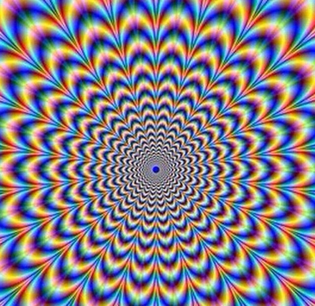

# IK-31-Prshesmytskyi Lab1

Lab1 add image

1 Склонував репозиторій команда $ git clone https://github.com/Mykola-Prshesmytskyi/IK-31-Prshesmytskyi.git

2 Закомітив файл до репозиторію

3 хеш -e2665b22f9acb973ee7f15dac8e1a6688ea106ec команда $ git log

4 Створив гілку за допомоги команди $ git branch mv1. Перейшов на гілку за допомоги команди $ git checkout mv1.

5 Перейшов в гілку main:
$ git checkout main
В гілці main не відображаються зміни тому що це головна гілка репозиторію, а інша гілка є "копією"

6 Внесення змін за допомоги команди $ git pull
Чому виник конфлікт:
конфлікт виник через те що були 2 одинакові файли з різним текстом і щоб правильно їх об'єднати потрібно щоб весь текст в одному з файлів був наявний в іншому файлі(який з'єднуємо)

7 Картинка:

